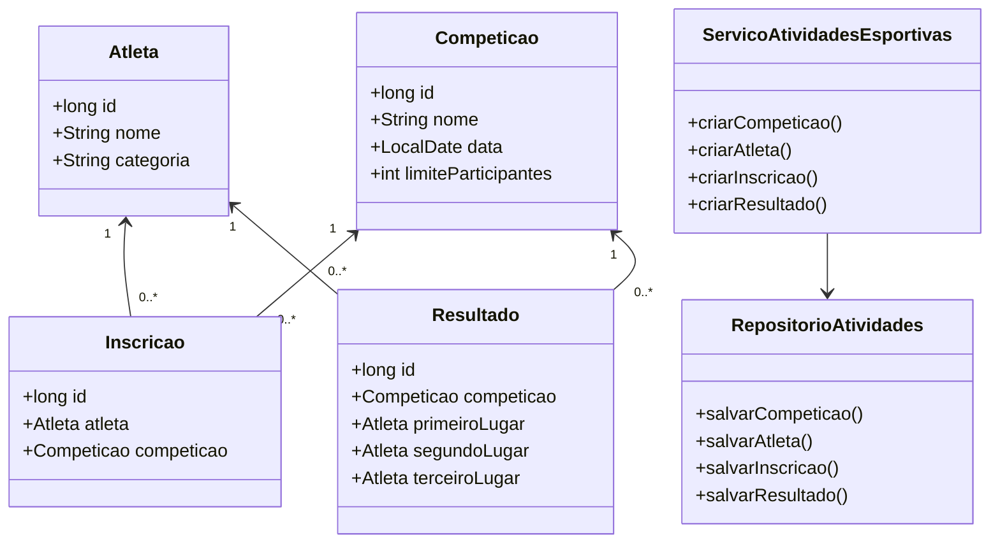
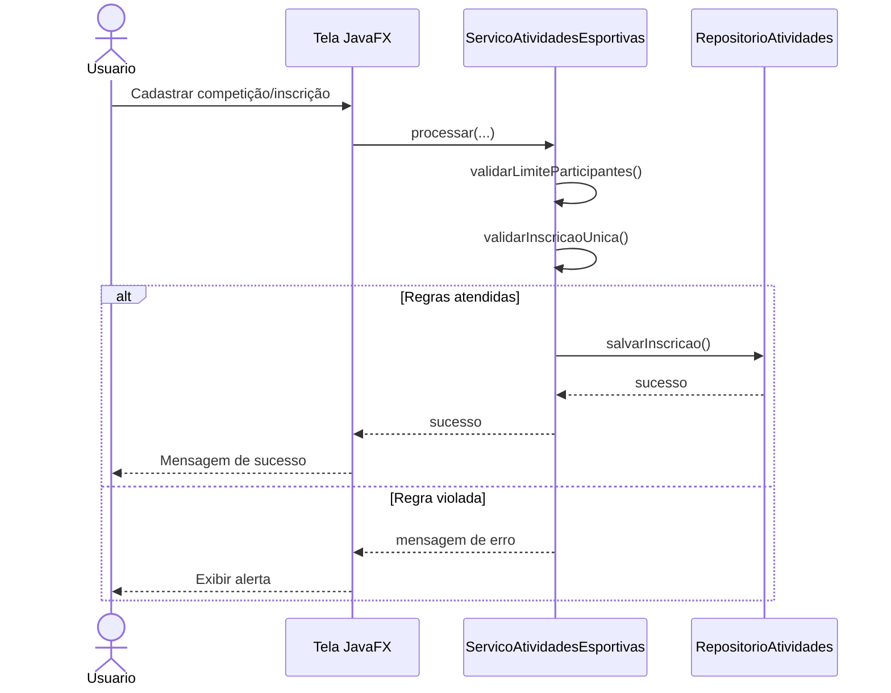

# Sistema Esportivo

Sistema desktop em Java 17 com JavaFX e arquitetura em três camadas para cadastro de competições, inscrição de atletas e publicação de resultados/classificação.

## Requisitos atendidos

- Tela JavaFX para cadastro de competições, inscrição de atletas e visualização de resultados/classificação.
- Validação de nome da competição, data e categoria do atleta.
- Regras de negócio para limite de participantes e inscrição única por atleta.
- Armazenamento em memória com `ArrayList`.
- Operações CRUD no repositório para competição, atleta, inscrição e resultado.

## Como executar

1. Compilar e executar os testes:

```bash
mvn test
```

2. Executar a aplicação desktop:

```bash
mvn javafx:run
```

## Estrutura das camadas

- `controller`: camada de apresentação JavaFX.
- `business`: regras de negócio e validações.
- `data`: repositório em memória.
- `model`: entidades do domínio.

## Diagrama de classes



## Diagrama de sequência: cadastrar inscrição



## Verificação sugerida

- Abrir a aplicação e cadastrar uma competição com limite de participantes.
- Cadastrar atletas e realizar inscrições.
- Tentar duplicar inscrição do mesmo atleta na mesma competição.
- Completar o limite da competição e tentar uma nova inscrição.
- Abrir a tela principal e conferir os resultados publicados.